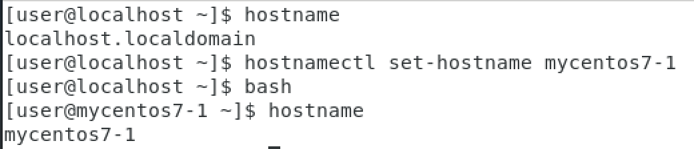
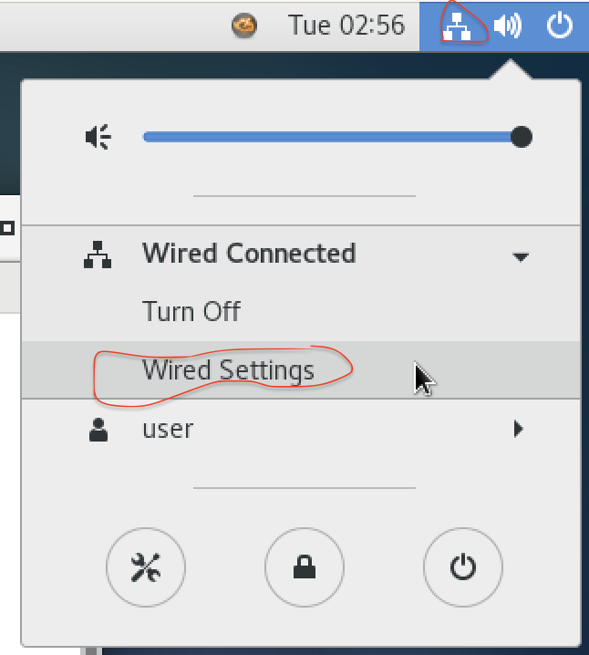
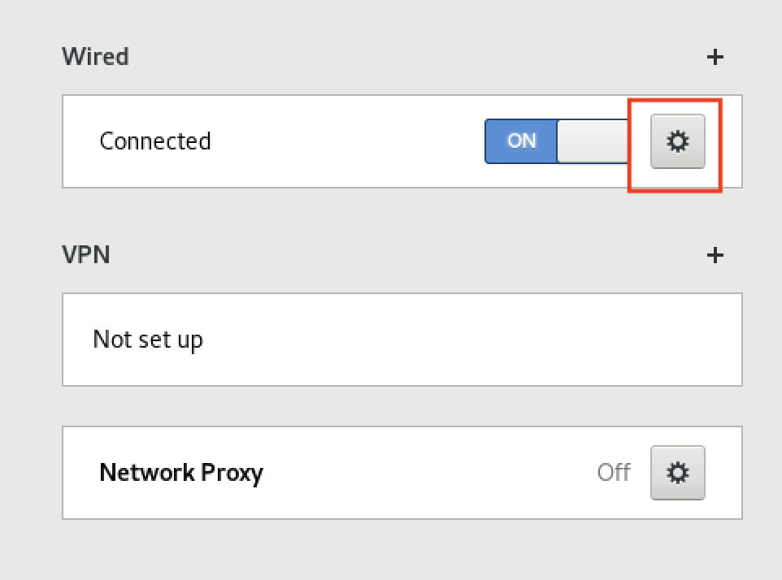
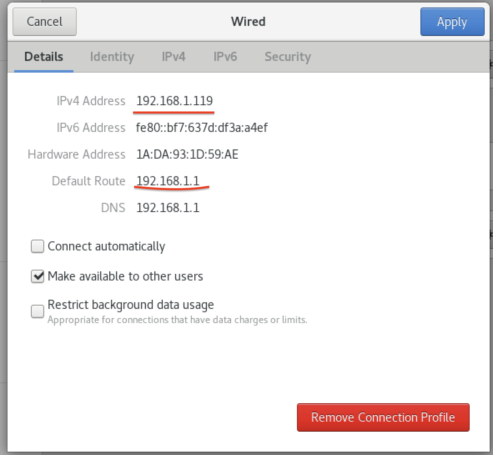
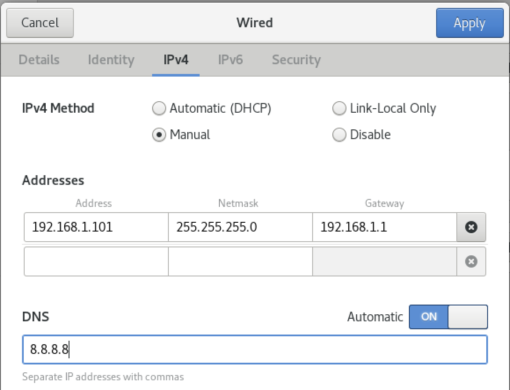
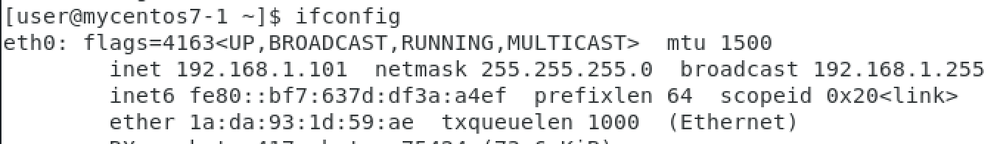
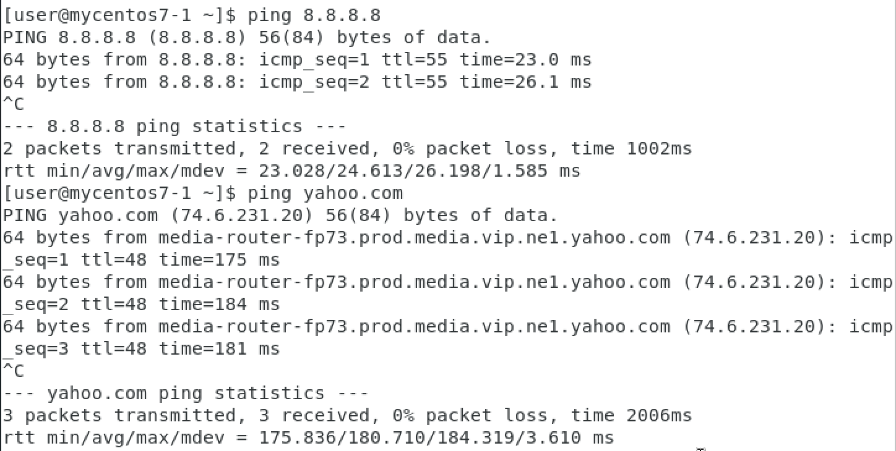
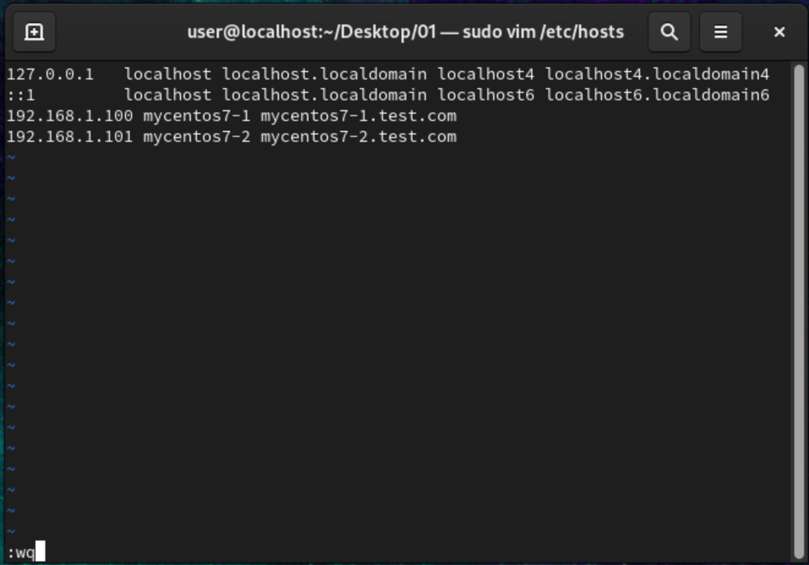
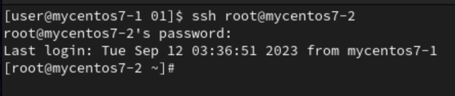

FTP
- csie2.nqu.edu.tw
- user
- user1234@#

Week 9 
- Midterm
- 25 簡答題， 什麼指令可以幹嘛

Week 16,17
- Final, practical 

This semester content:
1. yum
2. df dd du wc tr ssh scp
3. shell script
4. network related commands
5. scheduling
6. www server
7. mysql
8. php
9. domain server
10. .... servers

Servers 
- MySQL
- Docker : 輕量級虛擬化的容器, 有時間會介紹
- Amazon Web service : 大四的課
- Zabbix : 下學期的課會有講到
- Nginx : Web server, not include in this class

Different
- ubuntu : apt, apt-get
    - more in research, last 5 years
- centos : yum
    - industry, last 10 years 

# **HW1**

# **HW2**
- Step 1

- Step 2

- Step 3

- Step 4

- address change `119` to `101` for mycentos7-2, first 3 column can't change
- Step 5, reconnect network

- Step 6, done

# **HW3**
- Step 1 : `vim /etc/hosts`
- Step 2, enter both ipv4 address and hostname 

- Step 3 : use mycentos7-1 host execute `ssh root@mycentos7-2` and enter root password of mycentos7-2

# **Command**
`hostname`
- Show host name

`hostnamectl set-hostname mycentos7-1`
- set host name to **mycentos7-1**
- need to execute `bash` after 

`rpm -qa | grep ssh`
- `rpm` : where can check installed server , `q` : query , `a` : all 

`rpm -e openssh-server`
- `e` : erase 
- `yum install openssh-server`

`systemctl start sshd`
- `start` : can be others control commmand, ex : `status`,`stop`,`restart`,`reload`
- `sshd` : ssh server, can be others servers, ex : `httpd`,`vsftpd`