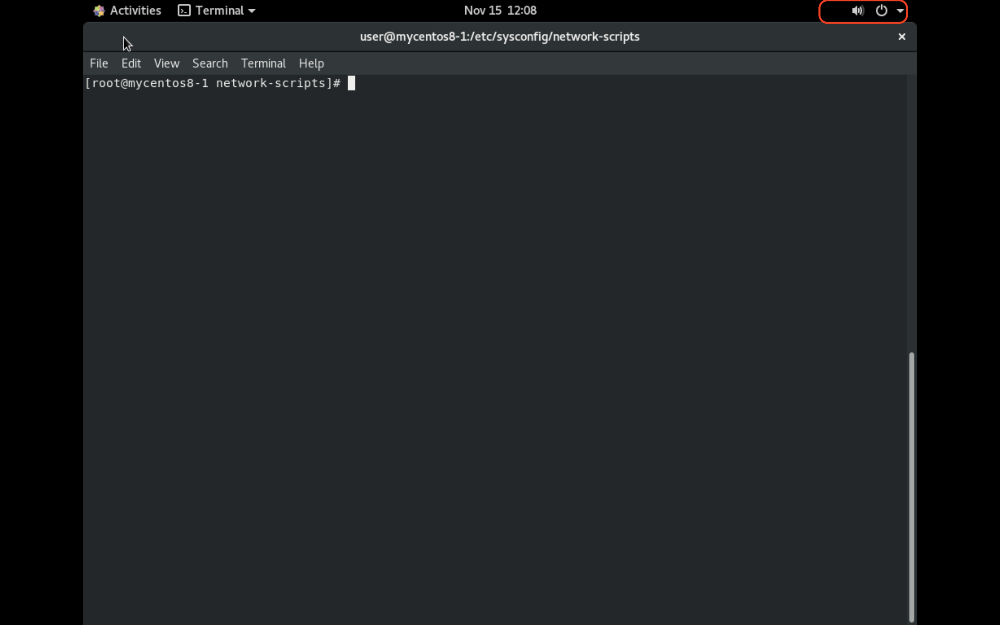

# **Bash Script**
## **Curly Brackets{}**
- `a=5`
    1. `echo $aa` 
    2. `echo ${a}a`
```
Output 1 : unknown
Output 2 : 5a
```
- `a=123456789`
    1. `echo "${a:1:3}"` 
    2. `echo $a | cut -c 2-4`
```
Output 1 : 234
Output 2 : 234
```

- `echo ${#a}` : show how many character
    1. `a=1234`
    2. `a="Hello"`
```
Output 1 : 4
Output 2 : 5
```
- `greet="Hello World"`
    1. `echo ${greet/World/$(whoami)}` : use `$(whoami)` replace `World` inside `greet`
```
Output 1 : Hello user
```
- `for i in {1..10}; do` : i = 1,2,3,4,5,6,7,8,9,10
- `for i in {0..10..2}; do` : i = 0,2,4,6,8,10 
```
for i in {1..10}; do
  if ((i%2==0)); then
    continue
  fi  
  if ((i==7)); then
    break
  fi
  echo "${i}" # print 1, 3, 5                            
done
```
- Use `((i%2==0))` 有無空白都行
- Inline loop
    1. `while true; do echo $(whoami); sleep 1; done;`
    2. `a=1`
        - `while [[ $a -le 5 ]]; do echo $a; ((a++)); sleep 1; done;`
- 多重判斷
    - `-o` : or
    - `-a` : and
- `[[]] (())` : 比較(test)
    - `[[]]` : for string comparison
    - `(())` : for integer comparison
- `=~` : can use for regexp
    - `re='^[0-9]+$'` : `^`(start with) , `[0-9]`(1,..,9) , `+`(at least 1) , `$`(end with)
        1. `a=1234`
        2. `a="Hello"`
        - `[[ $a =~ $re ]] && echo "number" || echo "not number"`
        
```
Output 1 : number
Output 2 : not number
```

- Array
    - `array=("123" "456" "789")`
        1. `echo ${array[0]}`
        2. `echo ${array[1]}`
        3. `echo ${array[2]}`
        4. `echo ${#array[@]}`
```
Output 1 : 123
Output 2 : 456
Output 3 : 789
Output 4 : 3
```

- 運算
    1. `echo $((1+100))`
    2. `let a=1+100` 
        - `echo $a`
    3. `echo 1.2*3+4.5 | bc` : float number calculation
```
Output 1 : 101
Output 2 : 101
Output 3 : 8.1
```

# **Chap 13**
1. Network Manager
    - Auto setting, Graphical
    - Only choose 1 from `Network Manager` and `network`
2. network
    - Manually setting, text interface
    - Only choose 1 from `Network Manager` and `network`

## **network Command**
- `ifconfig ens33 down` : Shutdown **ens33** NIC
- `ifconfig ens33 up` : Start **ens33** NIC
- `ifconfig ens33 0` : Clear ip setting(inet,netmask,broadcast) of **ens33**
- `ifconfig ens33 192.168.153.130 netmask 255.255.255.0` : Set ipv4 and netmask of **ens33**
- `ifconfig ens33 mtu 1000 up` : Change **ens33** MTU to 1000 bytes
- `ifconfig ens33 hw ether aa:bb:cc:dd:ee:ff` : Change **ens33** MAC address in OS
- `ifconfig ens33:1 192.168.153.131 netmask 255.255.255.0` : Create a extra virtual NIC for **ens33** and call it **ens33:1** with different ip address  
    - 畫圖
## **ip command**
- `ip addr show` : show network device information
    - `ip a s` : Same with `ip addr show`
- `ip -s link show ens33` : Show statistic information of **ens33**
- `ip addr add 192.168.153.132/24 brd + dev ens33` 
    - `brd` : can accept broadcast
    - `dev ens33` : Specific to device **ens33**
- `ip addr del 192.168.153.131/24 dev ens33` : Delete virtual ip **192.168.153.131/24** from **ens33**
- `ip route show` : Show ip route information
- `ip route add default via 192.168.153.2` : Add default ip route table through `192.168.153.2`
- `ip route del default` : Delete default ip route 

## **NetworkManager to network**
- Prestep : Check device, ip address, and gateway
    - 
    - Device : **ens160**
    - Ip address : **172.20.10.3**
    - Gateway : **172.20.10.1**
1. `systemctl disable NetworkManager.service` : Not neccesary
2. `systemctl stop NetworkManager.service`
    - 網路標籤會不見
    - 
3. `cd /etc/sysconfig/network-scripts`
    - `vim ifcfg-ens160` : In my case is **ens160** and edit file
    - DEVICE , IPADDR , GATEWAY need to check before stop **NetworkManager**
```
TYPE=Ethernet
DEVICE=ens160
ONBOOT=yes
BOOTPROTO=static
IPADDR=172.20.10.3
NETMASK=255.255.255.0
GATEWAY=172.20.10.1
```
4. `systemctl start network.service`
    - `systemctl status network.service` : Will show active
    - `yum install -y network-scripts` : CentOs8 need to install manually
    - Add **HWADDR=MAC_Address** into **ifcfg-ens160** (check before stop NetworkManager) if `systemctl start network` failed

5. `systemctl restart network.service`
    - `ping 8.8.8.8` : If success will be able to ping 8.8.8.8


## **netstat**
- `netstat -tunlp | grep 80`
    - `t` : tcp
    - `u` : udp
    - `n` : 不解析
    - `l` : listening
    - `p` : process id
# **Extra**
- Cloud server
    - aws(Amazon) 
    - azure(Microsoft) 
    - gcp(Google)

- | Ethernet header | IP header | payload | FCS |
    - Ethernet header
        - 6 bytes : Destination MAC
        - 6 bytes : Source MAC
        - 2 bytes : Type(0x0800 -> ip , 0x0806 -> ARP)
    - FCS 
        - 4 bytes
    - MTU : Maximum transmissions unit of the package