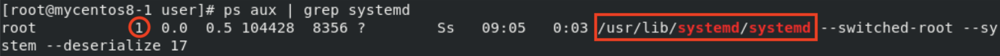
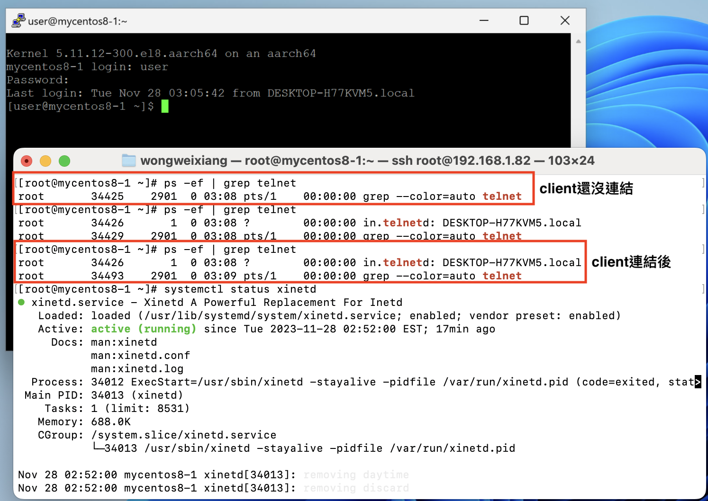

# **Chap 14**
## **systemd**
- `init` : 舊一代的系統服務管理, pid=1
    - When starting up the computer, the process is activate 1 by 1, the more process need to active the more time needed(一個process啟動完再啟動下一個process，啟動的process越多開機較慢)
- `systemd` : 新一代的系統服務管理, pid=1
    - When starting up the computer, will detect the dependency of the process, if not then can active together, will be faster than init(會判斷process之間有沒有相依性，若無就可以同時啟動process,開機較快)
    - `ps aux | grep systemd`
    - 
    - systemd & init 的差別2:04pm video
- `/usr/lib/systemd/system` or `/etc/systemd/system`
### **Unit**
- **Unit**
    - `Destription` : information of the service
    - `Documentation` : How to check the detail & document of this service
    - `After` : need to start after these services start, but not necessary
    - `Wants` : Must have these services started before the service start
-  **Service**
    - All services provided by the service 
    - How to user the services and the environment
- **Install**
    - Need what kind of mode
### **Target**
- init 的 runlevel
    - `0` : Single mode (單人模式)
    - `3` : Multiple-user text mode (文字多人模式) 
    - `5` : Graphical mode(圖形化模式)
- systemd 的 target
    - `multi-user.target` : text multiple-user mode, like runlevel 3
    - `graphical.target` : Graphical mode(圖形化模式)
- `systemctl isolate multi-user.target` : change to text mode (切換到文字模式)
- `systemctl isolate graphical.target` : change to graphical mode (切換到圖形化模式)

## **Services type**
1. `.service`
    - Always standby in background process
    - React fast to request
    - Waste resources
2. `.socket`
    - Only activated when client request
    - React slower than `.service`
    - Save resources


# **Extra**
- `/etc/resolv.conf` : For linux DNS server setting

# **echo server**
- server site
## Step 1
- `vim /opt/echo_server.py` : copy the python code into this file
```
#!/usr/bin/env python3
import socket

# 建立 socket
serv = socket.socket(socket.AF_INET, socket.SOCK_STREAM)

# 綁定所有網路介面的 9000 連接埠
serv.bind(('0.0.0.0', 9000))

# 開始接受 client 連線
serv.listen()

while True:

    # 接受 client 連線
    conn, addr = serv.accept()
    print('Client from', addr)

    while True:

        # 接收資料
        data = conn.recv(1024)

        # 若無資料則離開
        if not data: break

        # 傳送資料
        conn.send(data)

    conn.close()
    print('Client disconnected')
```
- `chmod +x /opt/echo_server.py`
## **Step 2**
- `vim /etc/systemd/system/echo_server.service` : copy the configuration code into this file
```
[Unit]
Description=Echo Server

[Service]
Type=simple
ExecStart=/opt/echo_server.py
Restart=always

[Install]
WantedBy=multi-user.target
```
- `chmod 644 /etc/systemd/system/echo_server.service`
- `sudo systemctl daemon-reload`
## **Step 3**
- `sudo systemctl start echo_server`
- `systemctl status echo_server`

## client site
- `nc localhost 9000`

# **telnet**
## **Step 1**
- `sudo yum install -y telnet*`
- `sudo yum install -y xinetd`
## **Step 2**
- `sudo systemctl start telnet.socket`
- `sudo systemctl start xinetd`
## **done**

## **client**
- Open putty and use 23 port to connect