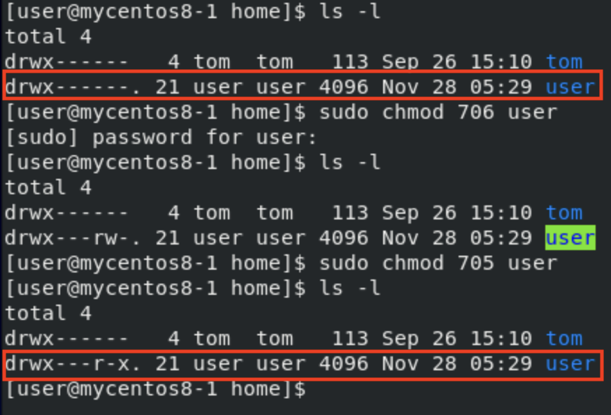

# **Web Server with MariaDB**
## **Step 1 : Install and setting Mariadb**
- `sudo yum install mariadb-server mariadb`
- `sudo systemctl start mariadb`
- `sudo mysql_secure_installation` : Setting mariadb 
- `mysql -u root -p -h localhost` : Login into mariadb
    - `-u` : user account
    - `-p` : Enter password later
    - `-h` : Server's location
    - 
    - MariaDB Commands
        - `show databases;` 
        - `create database testdb;`
        - `use testdb;`
        - `create table addrbook(name varchar(50) not null, phone char(10));`
            - create a table named addrbook, with **name** and **phone** fields
        - `insert into addrbook(name, phone) values("tom", "0912123456")`
            - Insert into addrbook table with value **tom** and **0912123456**
        - `select name,phone from addrbook`
            - Show **name** and **phone** columns in table **addrbook**
        - `update addrbook set phone="0987654321" where name="tom"`
            - Update the column value
        - [SQL語法](https://www.fooish.com/sql/)
## **Step 2 : Install and test php**
- `sudo yum install -y php`
- `sudo yum install php-mysqlnd` : Centos8
- `sudo yum install php-mysql` : Centos7
- `sudo systemctl restart httpd`
- `sudo vim /var/www/html/info.php` : Enter Below into info.php
```
<?php phpinfo(); ?>
```
- `ifconfig` : To check your ipaddress, ex:172.20.10.3
- `http://172.20.10.3/info.php`
    - 
## **Step 3**
- `setsebool httpd_can_network_connect_db=1` : If can't connect to db
- `vim /var/www/html/testdb.php` : Enter code below
```
<?php
$servername="127.0.0.1";
$username="root";    
$password="centos";
$dbname="testdb";

$conn = new mysqli($servername, $username, $password, $dbname);

if($conn->connect_error){
    die("connection failed: " . $conn->connect_error);
}
else{
    echo "connect OK!" . "<br>";
}

$sql="select name,phone from addrbook";
$result=$conn->query($sql);

if($result->num_rows>0){
    while($row=$result->fetch_assoc()){
        echo "name: " . $row["name"] . "\tphone: " . $row["phone"] . "<br>";
    }
} else {
    echo "0 record";
}
?>
```
- 

done

# **Chap 15**
- LAMP,apache

## **HTTP**
- Architecture on  TCP/IP(short connection,disconnect after data transfered(傳完資料就斷線))
    - Make it into long connection, the connection can last longer and transfer data with it, don't have to spend too much time on connect(三項交握) and disconnect(半關閉)
- The server don't have memory of who connect with
    - Cookie(at client site) & Session(at server site) to implement "memory"
- Web server replied status code
    - `1xx` : Information
    - `2xx`
        - `200` : success
    - `3xx` : redirected
    - `4xx` : client site error
        - `404` : Web page not found
    - `5xx` : server site error
### **firewall**
- `firewalld`
- White list(白名單的方式) : Only the "person" on the white list can access
### **SElinux**
- Security Enhanced Linux
- On CentOs
### **Linux**
- `/etc/httpd` : home directory of web server
- `/etc/httpd/conf/httpd.conf` : Main configuration file of httpd server
- `/etc/httpd/conf` : Mian configuration directory of httpd server
- `/etc/httpd/conf.d` : Others configuration directory, ex: php,userdir,ssl,...
### **Modules**
- `/etc/httpd/modules/` : Others modules for httpd server, ex: php
### **extra**
- `systemctl reload httpd` : reload configuration 
    - will not disconnect the connection 
- `systemctl restart httpd` : closed and start server
    - will disconnect all connecitons
### **Log** 
- `/etc/httpd/logs` : a link to `/var/log/httpd`
- `/etc/httpd/logs/access_log`
    - `GET` : Download data from server
    - `PUT` : Upload data to server
    - `POST` : Renew data
    - `PATCH`
    - `DELETE` : Delete data
### **run**
- `cat /etc/httpd/run/httpd.pid` : Show the pid of the web server
- `ps -ef | grep httpd` : Show all processes related to httpd
- `kill -9 40695` : Only kill 1 process, but http server user several process to provide service
- `pkill -9 httpd` : Will kill all processes related to **httpd** service

### **Aliases**
- Maps web paths into filesystem paths and is used to access content that does not live under the DocumentRoot
- `vim /etc/httpd/conf/httpd.conf`
```
Alias /abc /data
<Directory /data>
Require all granted
</Directory>
```

## **Create web page in user's directory**
- `vim /etc/httpd/conf.d/userdir.conf`
    - 
    - 
        - Add `#` infront of **UserDir disabled**
        - Discomment the line **UserDir public_html** 
    - Create a **index.html** under user's home directory  
        - 
    - Go to browser and `172.20.10.3/~user/index.html` : **172.20.10.3**(ip address)
        - 
        - Because of **user** directory have limited permission
    - Change permission
        - 
        - Need to have read and execute permission
    - `172.20.10.3/~user/index.html`
        - 