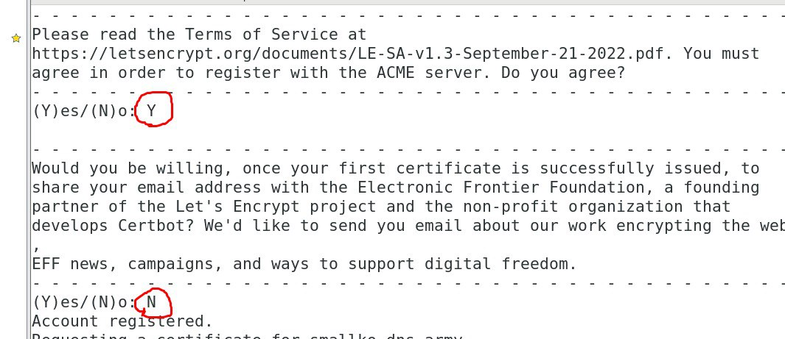

# **Https Web server**
- Requirements: Domain name, ipv6 address
    - [https://dynv6.com](https://dynv6.com)
## **Step 1 : Install all needed tools**
- `yum -y install epel-release mod_ssl`
- `yum -y install certbot`
## **Step 2 : Set ipv4 & ipv6 address with domain name**
- [https://dynv6.com](https://dynv6.com)
- `certbot certonly --webroot -w /var/www/html -d domain_name --email user@gmail.com`
    - ex: `certbot certonly --webroot -w /var/www/html -d xiang0550.dns.army --email studentid@student.nqu.edu.tw`
    - `nslookup domain_name` 
    - 
    - 
- Go to `/etc/httpd/conf.d/ssl.conf` and setting
    - 
    - 
- Restart httpd service and check it out
    - 
    - 

# **/etc/httpd/conf/httpd.conf**
- video
- `Options Indexes` : Will show all and allow access files in the directory
- `Options Indexes FollowSymLinks` : Will allow access file having soft link, access to the linked file
- Limits IP address
```
<Directory /var/www/html>
    Order allow,deny
    Allow from all
    Deny from 192.168.153.1
</Directory>
```
- Allow all ip address except **192.168.153.1**
```
<Directory /var/www/html>
    Order deny,allow
    Allow from 192.168.153.1
    Deny from all
</Directory>
```
- Only allow ip address **192.168.153.1**
# **Solution**
1. Isseus:
```
Curl error (60): Peer certificate cannot be authenticated with given CA certificates for https://vault.centos.org/centos/8-stream/AppStream/aarch64/os/repodata/repomd.xml [SSL certificate problem: EE certificate key too weak]
```
- Solutions:
    1. [Change to aliyun](https://blog.csdn.net/qq_36393978/article/details/128074095)
        - `curl -o /etc/yum.repos.d/CentOS-Base.repo http://mirrors.aliyun.com/repo/Centos-8.repo`
        - `yum clean all`
        - `yum makecache`
    2. [Change to CentOS Stream](https://benjr.tw/104230)
        - `dnf install centos-release-stream -y --allowerasing`
        - `dnf distro-sync -y`
        - `more /etc/redhat-release`

2. Issues:
```
No match for argument: certbot
Error: Unable to find a match: certbot
```
- 

3. Issues:
```
Unable to read consumer identity

This system is not registered with an entitlement server. You can use subscription-manager to register.
```
- Solution
    - `vim /etc/yum/pluginconf.d/subscription-manager.conf`
    - Set `enabled=0`
    - [reference](https://www.cnblogs.com/ajunyu/p/13297449.html)

4. Issues:
```
Error: 
 Problem: conflicting requests
  - nothing provides python3.6dist(cryptography) >= 2.5.0 needed by python3-certbot-1.22.0-1.el8.noarch from epel
  - nothing provides python3.6dist(distro) >= 1.0.1 needed by python3-certbot-1.22.0-1.el8.noarch from epel
(try to add '--skip-broken' to skip uninstallable packages or '--nobest' to use not only best candidate packages)
```
- Solution
    - Check out **CentOS-Stream.md**

5. Issues:
```
An unexpected error occurred:
requests.exceptions.SSLError: HTTPSConnectionPool(host='acme-v02.api.letsencrypt.org', port=443): Max retries exceeded with url: /directory (Caused by SSLError(SSLError(1, '[SSL: CERTIFICATE_VERIFY_FAILED] certificate verify failed (_ssl.c:897)'),))
```

6. Issues: from CentOs9
```
Hint: The Certificate Authority failed to download the temporary challenge files created by Certbot. Ensure that the listed domains serve their content from the provided --webroot-path/-w and that files created there can be downloaded from the internet.

Cleaning up challenges
Some challenges have failed.
Ask for help or search for solutions at https://community.letsencrypt.org. See the logfile /var/log/letsencrypt/letsencrypt.log or re-run Certbot with -v for more details.
```