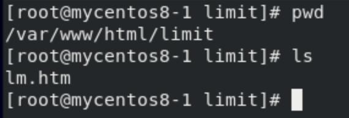
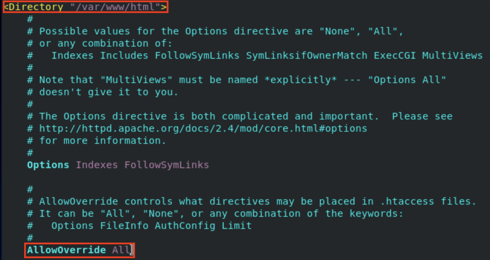
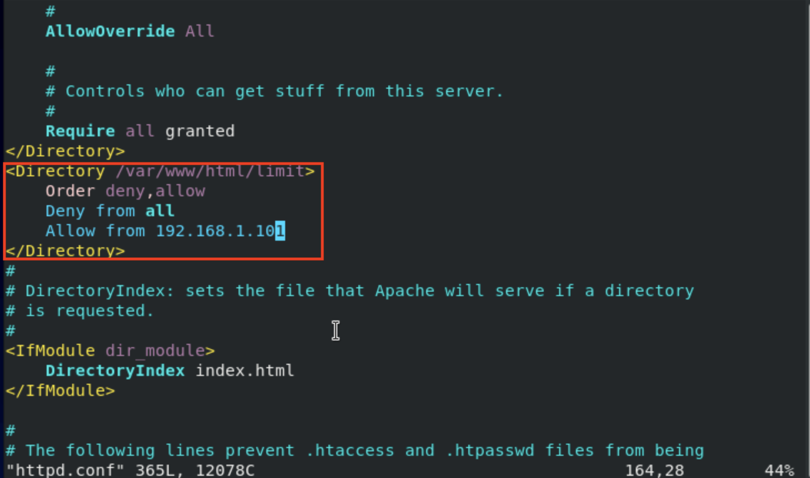
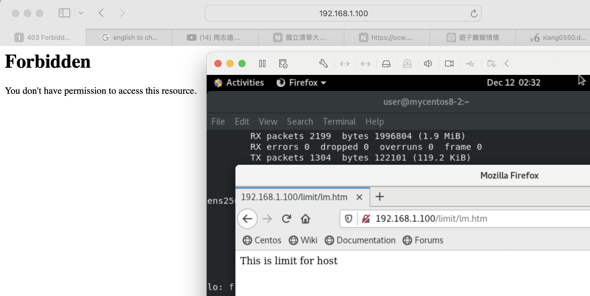
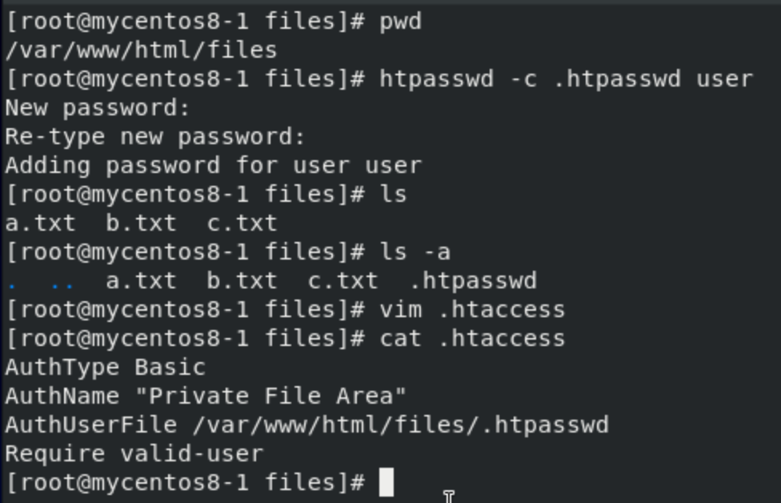
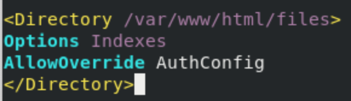
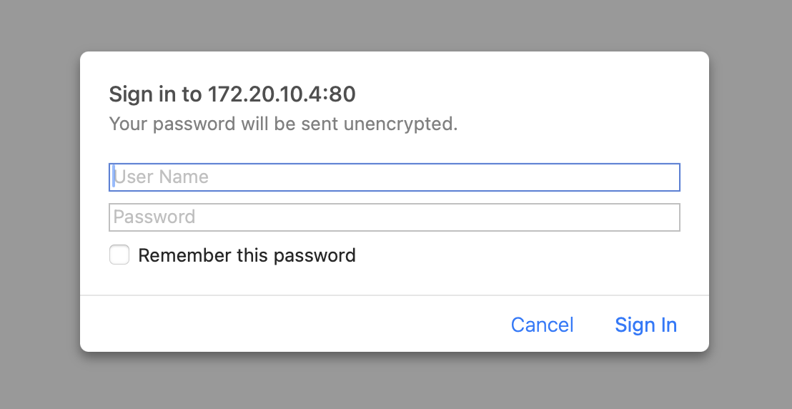
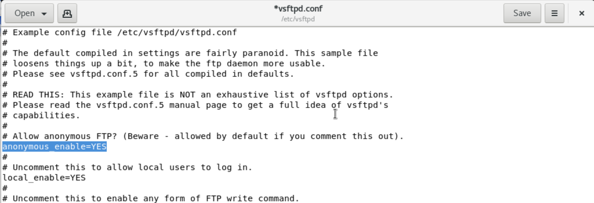
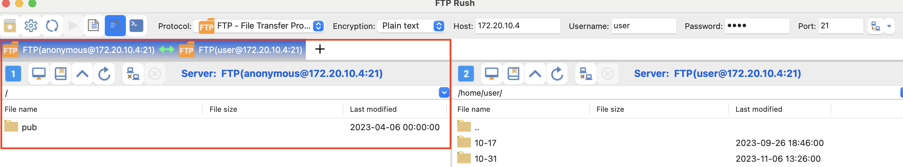

# **Limit ip address to connect**
## **Step 1 : Create a htm file under the target limit folder**

## **Step 2 : Edit the configuration file for httpd**
- `vim /etc/httpd/conf/httpd.conf`
- 
    - Make sure **AllowOverride** == All
- 
    - Add new rule to the `/var/www/html/limit` folder
    - This rule only allow ip address `192.168.1.101` to access this folder
## **Step 3 : Restart httpd server**
- `systemctl restart httpd`
- 

# **Access Control**
- To allow people with member to access the folder
- 
    - Enter target folder(**/var/www/html/files**) and set account for it
```
AuthType Basic
AuthName "Private File Area"
AuthUserFile /var/www/html/files/.htpasswd
Require valid-user    
```
- `vim /etc/httpd/conf/httpd.conf`
    - 
    - Insert code into the file

- 
    - And now when someone access to it will need to enter username and password

# **Chap 16 : FTP**
- sftp
    - sshd (secure)
    - Only have file transfer function, no others functions
- ftp
    - More function than sftp but no secure 
## **Protocol**
- Use TCP protocol
- Server use 21 port, will open until server down
- 20 port, for data transfer, after data transmission done then close
- Commands:
    - `ls` : list all server's current directory files
    - `!ls` : list client's(local) current directory files
    - `get` : donwload from server
    - `put` : upload to server
    - `bin` : Transfer format with binary mode,switch to binary mode
    - `pwd` : Show server's current directory
    - `!pwd` : Show client's(local) current directory
    - `quit` : disconnect ftp
    - `mkdir` : Create new folder on server
    - `bye` : exit ftp server
    - `prompt` : Turn off/on interactive mode
    - `mput` : Upload multiple files
    - `mget` : Download multiple files
- `/etc/vsftpd` : Configuration files
    - `anonymous_enable=YES/NO` : allow anonymous login or not
    - `local_enable=YES/NO` : Allow local users to login or not
    - `local_umask=022` : Minus permission from 666 - 022 = 644 permission 
    - Only allow user stay at home directory, not allow to enter `/etc`, ...
        - `chroot_local_user=YES` 
        - `allow_writeable_chroot=YES`
## **FTP server**
- windows & linux different : 4.04 pm
### **Step 0 : Install ftp command**
- `sudo yum -y install ftp`
### **Step 1 : Install ftp server**
- `sudo yum -y install vsftpd`
### **anonymous login**
- `gedit /etc/vsftpd/vsftpd.conf`
    - 
- Login with username **anonymous** and password **abc@gmail.com**
- 