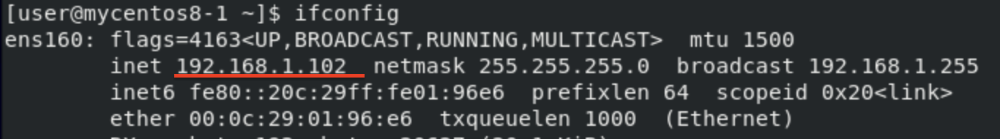
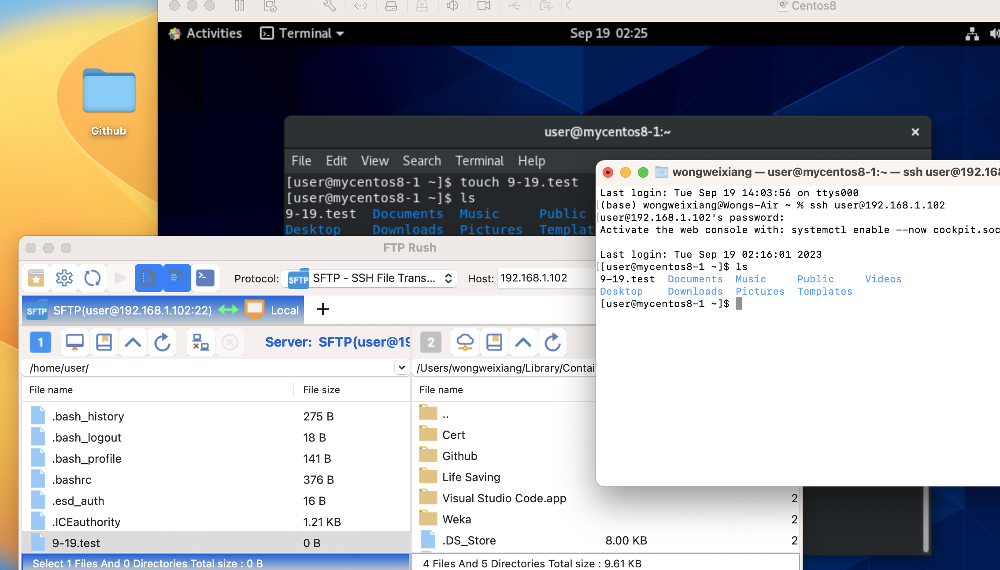
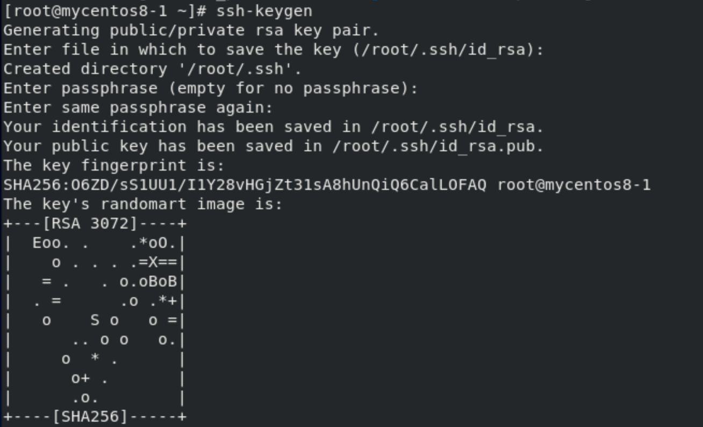
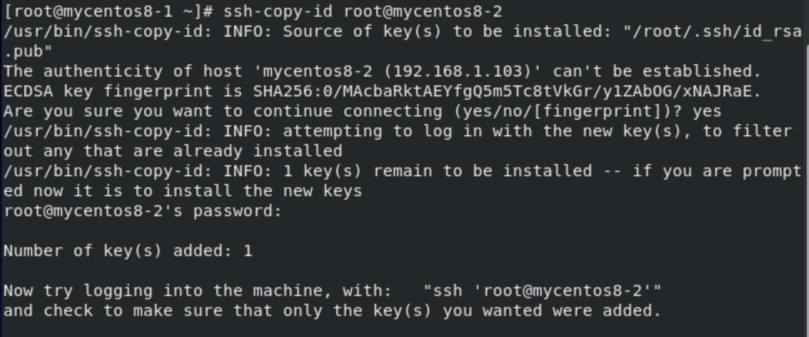
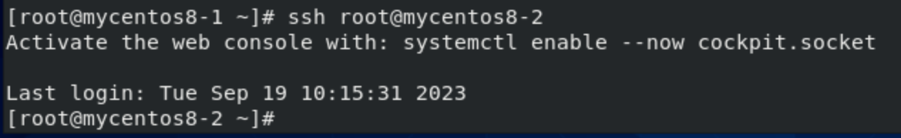

Virtual box
- NAT network adapter
    - Connect VM to Internet
- Host-only
    - Connect VM with host or others VM on the machine
- Need to Use 2 Network Adapter NAT and Host-only

VMware
- NAT network adapter
    - Can connect VM to Internet, host, and others VM on the machine
- Only need 1 Network adapter NAT

Software
- Putty, Winscp
    - 2 software will be use in this class on windows

0.0.0.0
- If the server is on `0.0.0.0:22` any interface can link to the server
    - If the server is on `1.2.3.4:22`, only the NIC `1.2.3.4` can link to the server

Network Error / Can't connect
1. Server is running? (systemctl status sshd)
2. Port number is on standard port number? (ssh => 22)(netstat -tulnp | grep ssh)
3. Selinux (getenforce)
    - change to **disabled**
4. Firewall (systemctl status firewalld)

# **HW1**
Requirement
- ssh server running on the VM
- network is connected

- get your VM ip address

Mac
- Open terminal and enter `ssh username@ipaddress`
    - `ssh user@192.168.1.102` in my case
- Open ftp software and connect with the ipaddress

done

# **HW2**
- 無密碼遠端登錄
Requirement
- 2 VM
- Set domain name for the second VM(`vim /etc/hosts`)

1. `ssh-keygen`

2. `ssh-copy-id root@mycentos8-2`

- mycentos8-2 is the domain name for my second VM, can replaced with ipaddress

3. `ssh root@mycentos8-2`

done

# **遠端執行指令**
`ssh root@mycentos8-2 ls /tmp/testdir`
- let mycentos8-2 (host) execute `ls /tmp/testdir`(command) on mycentos8-1

# **Chap10**
RPM
- Redhat Package Manager
- setup-2.8.71-4.el7.noarch
    - setup : package name
    - 2.8.71 : version
    - 4 : edition(bug repair)
    - el7 : 適用發行版, Redhat Enterprise Linux7, CentOS 7
    - noarch : any platform can use the package
- `rpm`
    - `-qa` : query all
    - `-qi httpd` : query information of httpd
    - `-ql httpd` : query list of all file of httpd
    - `-qf /etc/passwd` : query the file **/etc/passwd** is from which package
    - `-e` : erase

# **Command**
`netstat -tulnp | grep ssh`
- Check ssh port number

`vim /etc/selinux/config`
- To edit selinux

`vim /etc/hosts`
- To edit domain name and ip table

`scp /etc/hosts root@mycentos8-2:/etc/hosts`
- copy file from device to device, first parameter is source, second is destination
- copy folder need to add `-r`

`vim /etc/ssh/sshd_config`
- edit ssh port number of server