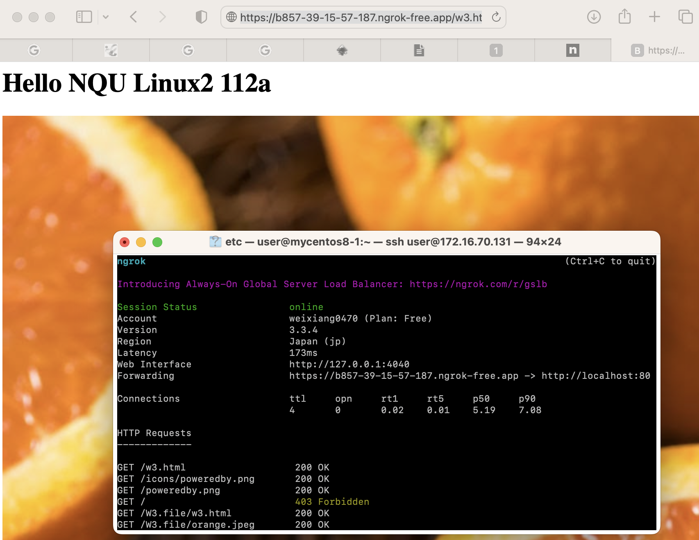

# **If server acting weird**
1. Make sure is using **superuser**
2. `getenforce` is **disabled**
3. **firewall** is **inactive**

# **Web server**
1. `rpm -qa | grep httpd`
    - if not installed => `yum install httpd -y`
2. `systemctl start httpd`

3. `cd /var/www/html` : go to the web server file location and create html file
4. `ifconfig` : check ip address

5. Go to Web browser and key in **ip_address/w3.html**


## **Ngrok**
1. Download ngrok
    - ngrok.com -> login

    - `wget https://bin.equinox.io/c/bNyj1mQVY4c/ngrok-v3-stable-linux-arm64.tgz` : for linux on arm architecture
2. `tar zxvf ngrok-v3-stable-linux-arm64.tgz` : to unzip, unpack the file

3. Go to **Your AuthToken** to copy the command with your ngrok's token
    - `./ngrok config add-authtoken your_authtoken` : `./` if ngrok not in the environment PATH

4. `./ngrok http 80` : start the http with ngrok at 80 port
    - make sure http server is on

5. Copy the link and paste in the web browser with the html file added
    - ex : `https://b857...ngrok-free.app/w3.html` , **w3.html** is my html file under **/var/www/html**

### **How ngrok working?**

- Without ngrok the user don't know the path to the web server of the VM


- With ngrok the user know the path to the web server of the VM through ngrok server

# **Centos8 Error**
- Error Message : **Error: Failed to download metadata for repo 'appstream': Cannot prepare internal mirrorlist: No URLs in mirrorlist**
- Solution:
    1. `sudo sed -i -e "s|mirrorlist=|#mirrorlist=|g" /etc/yum.repos.d/CentOS-*`
    2. `sudo sed -i -e "s|#baseurl=http://mirror.centos.org|baseurl=http://vault.centos.org|g" /etc/yum.repos.d/CentOS-*`
    - reference : https://forketyfork.medium.com/centos-8-no-urls-in-mirrorlist-error-3f87c3466faa

# **bash.repo**
- epel-release (第三方軟體套件)

## **YUM**
- yum 
    - CentOS
    - redhat
    - fedora
    - AWS
        - Amazon Linux

- apt
    - apt-get
    - Ubuntu

# **Compile source code**
- htop as example
1. `wget https://src.fedoraproject.org/lookaside/extras/htop/htop-2.2.0.tar.gz/sha512/ec1335bf0e3e0387e5e50acbc508d0effad19c4bc1ac312419dc97b82901f4819600d6f87a91668f39d429536d17304d4b14634426a06bec2ecd09df24adc62e/htop-2.2.0.tar.gz` : download the zip file with the wget command and the link

2. `tar zxvf htop-2.2.0.tar.gz` : unzip and unpack the file downloaded from step 1

3. `yum -y install gcc ncurses-devel` : htop require **gcc** and **ncurses-devel**

4.  `cd htop-2.2.0` : go in the file to install

5. `./configure` : configure the file
    - Will check if the library enough?
    - If yes will create make file, if not will give notice

6. `make` : compile the file

7. `make install` : install the software. ex: **executable file** will put under **bin folder**, **configuration file** will put under **etc folder**
    - Need root user

8. `htop` : start the **htop** app
    - Output:
    

- Error : My Centos8 occur the error below (at step 6)
```
[root@mycentos8-1 htop-2.2.0]# make
./scripts/MakeHeader.py CategoriesPanel.c
/usr/bin/env: 'python': No such file or directory
make: *** [Makefile:1416: CategoriesPanel.h] Error 127
```
- Solution
    1. `yum install python39` : htop require python so we need to install python first
    2. `export PATH=/usr/bin/python3:$PATH` : export python3 into environment variable
    3. `ln -s /usr/bin/python3 /usr/bin/python` : link **/usr/bin/python3** with **/usr/bin/python**

# **du**
- Estimate file space usage, a command to show space usage situation
- `-h` : use comman unit
- `-s` : summary 

- `du -h -s /var` : Show the summary of space usage of **/var** directory in common unit (k/M/G)
- `--max-depth=1` : show max depth (1) of the directory


# **df**
- A command to show disk partition(mounted) information 

- `df -h | grep /$` : grep the line end with `/` 
- `df -h | grep /$ | awk '{print $5}'`
- `df -h | grep /$ | awk '{print $5}' | tr "%" " "`
- `ava=$(df -h | grep /$ | awk '{print $5}' | tr "%" " ")`
- `echo $ava`