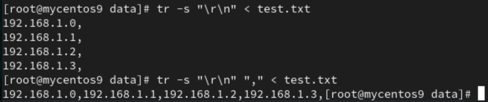

# **NFS**
- Network file system
    - client-server model
    - File sharing through network(nfs server)
- Command :
    - `mount`
- Usage :
    - Load Balances with many web server and db

## **Practical**
Server :
1. `cd /`
2. `mkdir /data -p` : `-p` 如果資料夾已經存在那就不做
3. `sudo yum install nfs-utils -y`
4. `sudo systemctl enable rpcbind` 
5. `sudo systemctl enable nfs-server` 
    - on x86 architecture use `sudo systemctl enable nfs`
6. `sudo systemctl start rpcbind`
7. `sudo systemctl start nfs-server`
    - on x86 architecture use `sudo systemctl start nfs`
8. `vim /etc/exports`
    - `/data 192.168.1.1/24(rw,sync,no_root_squash,no_all_squash)`
        - export to which network(default gateway)
        - `rw` : permission, read, write
        - `sync` : synchronization
        - `no_root_squash` : can use root permission
        - `no_all_squash` : can use user permission
9. `systemctl restart nfs-server`
    - on x86 architecture use `systemctl restart nfs`
10. `showmount -e localhost`
    - 

Client :
1. `cd /`
2. `mkdir /nfs-data -p`
3. `sudo yum install nfs-utils`
4. `sudo systemctl enable rpcbind`
5. `sudo systemctl start rpcbind`
6. `showmount -e 192.168.1.104`
    - 
7. `sudo mount -t nfs 192.168.1.104:/data /nfs-data`
    - `-t nfs` : type of mount is nfs
    - `192.168.1.104` : server ip address
    - `:/data` : which folder on server machine
    - `/nfs-data` : mount on which folder on the client machine

- done
    - 
    - All nfs server and client now shared the same data

**_/etc/exports : 把什麼東西分享出去，給誰用_**

# **dd**
- Use to create a file with any size(用於產生任意大小檔案的指令)
- `dd if=/dev/zero of=file3m bs=1M count=3`
    - `if=/dev/zero` : from **/dev/zero** input file source
    - `of=file3m` : output file name **file3m**
    - `bs=1M` : output 1M size segment
    - `count=3` : output 3 times(segment)

# **wc**
- word count 
- `-l` : show how many line 
- `-w` : show how many words
- `-c` : show how many letters
- 
## **HW**
- https://nqucsie.myqnapcloud.com/smallko/sdn/frp.htm

# **tr**
- delete or replace word(s)(用來做取代或替換)
- `echo "ABC" | tr [:upper:] [:lower:]` : replace all upper letter by lower letter, ex: ABC -> abc
- `tr 'A-Z' 'a-z'` : Upper to lower
- `-d` : Delete all character in the bracket
    - `echo "HellO WorlD1234" | tr -d 'A-Z'` : Output = `ell orl1234`
    - `echo "HellO WorlD1234" | tr -d '0-9'` : Output = `HellO WorlD`
- `-c` : Complement, replace all character **not** in the first bracket
    - `echo aa.,a 1 b#$bb 2 c*/cc 3 ddd 4 | tr -d -c '0-9 \n'` : Output = `1  2  3  4`
- `-s` : Squeeze-repeats 
    - `echo "thisss is    -ssss" | tr -s "s "` : Output = `this is -s`
    - `tr -s "\r\n" < test.txt` & ` tr -s "\r\n" "," < test.txt`
    - test.txt : 
    - Output : 
- `'\t'` : represent tab key

# **cat**
- `-T` : Can check is space or tab
    - 
    - **^** means tab key
- `-E` : Can show the end of line of each line with **$** sign
    - 

# **seq**
- sequence
- `seq start_value [accumulated_value] end_value`
- `seq -s "+" 1 10` : Output = `1+2+3+4+5+6+7+8+9+10`
- `-w` : make into same width 
    - 
    - 
# **bc**
- basic calculator in linux
- input an operational expression will give output
- `echo "1+5+10" | bc` : Output = `16`
- `seq -s "+" 1 10 | bc` : Output = `55`
