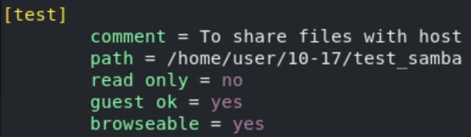
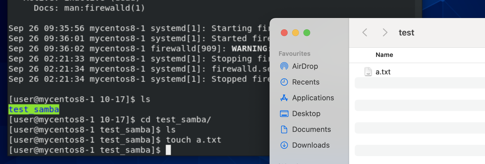
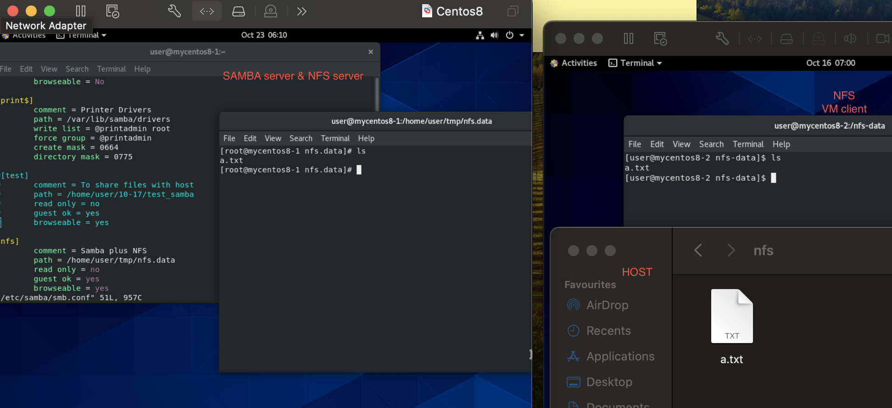
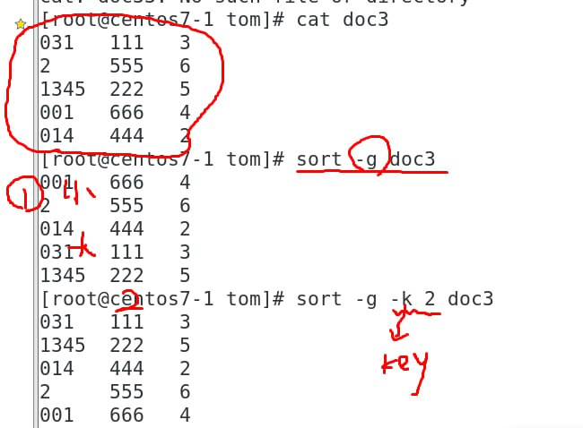
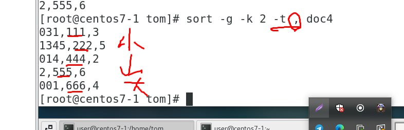
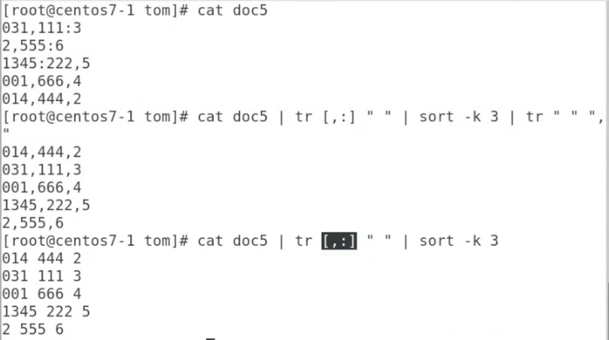
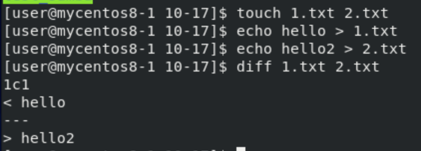
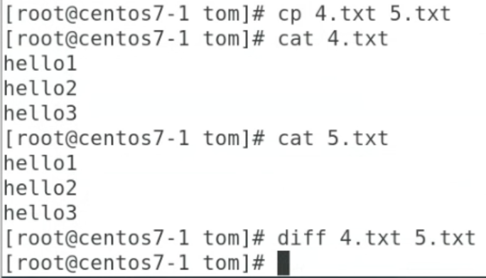

# **Samba**
- Let Windows and Linux(different OS) share resources (進行資源的共享)
    - **nfs** is Linux and Linux
- Ports : 445 & 139
- password draw
## **Steps**
1. `sudo yum install samba samba-client samba-common -y` : Instal samba
2. `mkdir /test_samba -p` 
3. `sudo chown nobody /test_samba` : To change owner of the file/folder
4. `sudo chmod 777 /test_samba` : To change the folder permission
    - `ls -ld /test_samba`
5. `vim /etc/samba/smb.conf` : To edit samba configuration
    - Add new tag
    - 
    - global(全局變量) 裡的 security 可以設誰可以進來
6. `testparm` : Check samba configure setting status
7. `sudo systemctl start smb`
8. `sudo netstat -tunlp | grep smb` : To check port is open
9. `sudo smbpasswd -a user` : Add password for samba account
    - samba don't user /etc/passwd
10. 到Host 
    - Windows : Open file manager(檔案總管) then enter linux ip address
    - Mac : Open finder and **cmd + k** and then enter linux ip address

### **Change user**
- Add user `sudo useradd tom` , `sudo passwd tom`
- `sudo smbpasswd -a tom`
- Windows : `net use * /delete`, then connect again

## **HW**
- nfs + samba
- 
    - Start NFS and Samba server at VM
    - Add the **nfs tag** into `/etc/samba/smb.conf`

# **SELINUX**
- Only in redhat, centos, fedora

# **sort**
- Can use to sort file line with ASCII code sequence
- `-r` : reverse
- `-g` : compare with general numeric instead of ASCII
- `-k` : specify column, ex: `sort -k 2 file` will sort by the second column of file
    - 
- `-t` : specify what sign to seperate column
    - 
- Mix
    - 
- Ex : 
    - `sort file`
    - `cat file | sort`

# **uniq**
- To merge repeated line in the file
- `uniq file`

# **cut**
- To get specify part of each line in the file
- `-d` : specify the sign that seperate column
- `-f` : specify which column(field)
    - `cut -d , -f 1,3 file`
        - **,** is the signal that seperate column
        - Get 1 and 3 column(field)
        - Can't change order
- `-b` : Take how many byte
    - `echo "12345" | cut -b 1-3` : Will give **123**, take first 3 characters

# **split**
- To make file into smaller file, each smaller file have the same size
- `split -b 1m file3m` : split the file3m into each subfile with **1m**
    - `-b` : block, **-b 1m** == each block is 1m
# **cat**
- Show file content, mix files(can use at jpg/pictures file)
- `cat hi.txt` : Show content of hi.txt
- `cat 1.txt 2.txt > 3.txt` : Mix content **1.txt & 2.txt** into **3.txt**

# **diff**
- To check different between 2 files
    - 
- If 2 file having same content => will not show anything
    - 

# **ping**
- icmp
    - echo request
    - echo reply
    - Windows disable in default

# **traceroute**
- Get the path from A to B
    - From A to B, which(how many) router(s) will be pass through
    - In Ipv4 packet, TTL field can set how many hop, ex: TTL=1, reach R1 and TTL=0, packet been throw and R1 will send icmp back to it, and now the sender know R1's ip address. Next set TTL=2, TTL=3, and so on

# **hostname**
- `hostnamectl set-hostname centos8-test`
    - set hostname to **centos8-test**

# **mail**
- `mail -s "1234" exmaple@gmail.com`
    - Enter message content
    - End with **ctrl + D**

# **Extra**
## **random password**
- `echo $RANDOM | md5sum`
    - `echo $RANDOM | md5sum | cut -b 1-8` : get first 8 characters