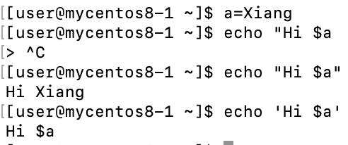
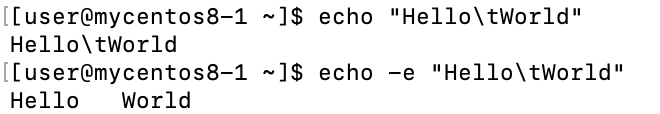
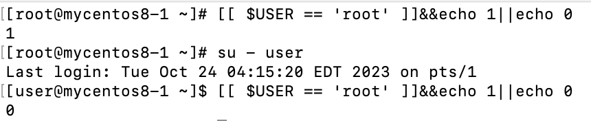

# **Http server with domain name**
## **Step 1**
- Connect wifi throught your phone's data
- Will get an ipv6 address start with **2001:...**
- Create html file under `/var/www/html`
## **Step 2**
- Start http server
- `sudo systemctl start httpd`

## **Step 3**
- [Get_domain _name](https://dynv6.com)
- `domain_name/html.file`
    - ex: `xiang0550.dns.army/w3.html`

# **ssh_error**
- Err 1
```
WARNING: REMOTE HOST IDENTIFICATION HAS CHANGED!
```
- Solutions
    - `ssh-keygen -R ip_address` 

# **alias**
- `alias` : default setting of the command
    - Which means when we execute command `cp` will auto turn into `cp -i`
    - `cp -i` : query if have the same file
```
alias cp='cp -i'
alias egrep='egrep --color=auto'
alias fgrep='fgrep --color=auto'
alias grep='grep --color=auto'
alias l.='ls -d .* --color=auto'
alias ll='ls -l --color=auto'
alias ls='ls --color=auto'
alias mv='mv -i'
alias rm='rm -i'
alias xzegrep='xzegrep --color=auto'
alias xzfgrep='xzfgrep --color=auto'
alias xzgrep='xzgrep --color=auto'
alias zegrep='zegrep --color=auto'
alias zfgrep='zfgrep --color=auto'
alias zgrep='zgrep --color=auto'
```
- If we want to execute original command need to add `\`, ex: `\cp`
- Son process(`bash`) will not share the alias if 
    - `alias cc='ls -al'`

# **Make new command share to all terminal**
1. Edit file `vim ~/.bashrc` : 
    - `vim /etc/profile` : need to be root， 套用到整個系統的使用者
2. Renew bash
    - `source .bashrc`
    - `. .bashrc`
    - Close and open new terminal

# **Terminal/Shell command**
- `a=Xiang`
    - `echo "Hi $a"` : Will show **Hi Xiang**
    - `echo 'Hi $a` : Will show **Hi $a**
    - 
- echo
    - `echo "Hello\tWorld"`
    - `echo -e "Hello\tWorld"` : need to add `-e` parameter to let `\t` works
    - 
    - `-n` : new line
- `$HOME` : current user's home directory
- `$IFS` : Default seperation sign
- `$PATH` : all path of executable command
- `$USER` : Show current user
    - `[[ $USER == 'root' ]]&&echo 1||echo 0`
    - 
- `$UID` : Show current user's id