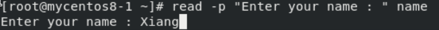
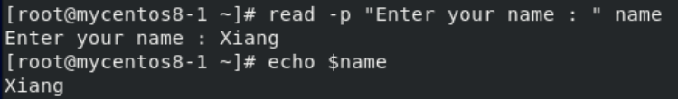
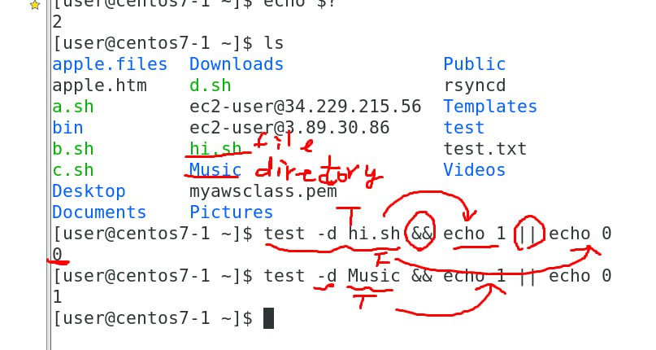
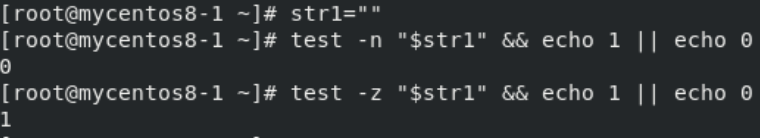
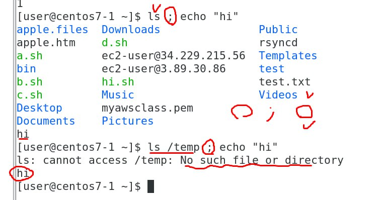
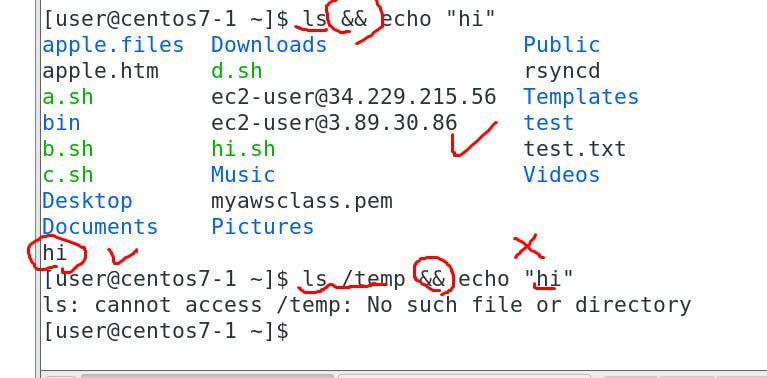
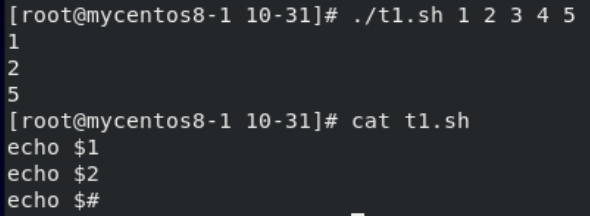
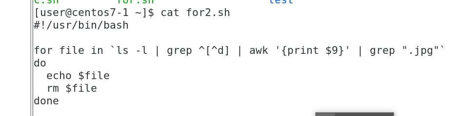
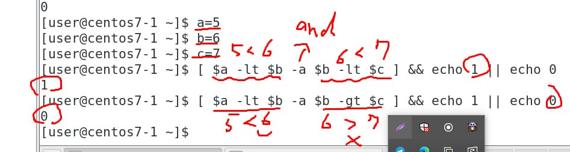

# **Variable**
- `${}`
```
a=100

echo $aa    ==> output : 
echo ${a}a  ==> output :  100a
```

- **''** & **""**
```
a=100
echo 'variable is $a' ==> output : variable is $a
echo "variable is $a" ==> output : variable is 100
```

- `read` : give user to input the variable
    - `-p` : Show the string
    - `read -p "enter your name : " name` : Will print out `enter your name : ` and wait for input
        - 
    - 

- `echo $?`
    - Show if the last command success? 
    - 0 => success
    - None 0 => fail
    - In linux 0 is **TRUE**

- `test`
    - File test
        - `-d` : is directory?
        - `-e` : exist?
        - `-s` : is file size > 0
        - `-r` : is the file readable?
        - `-w` : is the file writable?
        - `-x` : is the file executable?
        - `-L` : is the file is a link?
        - 
            - If `test -d hi.sh` return TRUE will execute the first part, else the second part
    - String test
        - `-n` : is the string length greater than 0?
        - `-z` : is the string empty? (empty return TRUE)
        - 
        - `=` : is the string same? (`$str1 = $str2`, need to have space before and after **=**)
    - Integer test
        - `n1 -eq n2` : n1 == n2?
        - `n1 -ne n2` : n1 != n2?
        - `n1 -ge n2` : n1 >= n2?
        - `n1 -gt n2` : n1 > n2?
        - `n1 -le n2` : n1 <= n2?
        - `n1 -lt n2` : n1 < n2?
    
- Link the commands
    - **;**
        - 
        - All command will execute even if the first command failed
    - **&&**
        - 
        - If the first command failed, command(s) afterward will not execute

# **Shell**
- add in shell
    - `let c=$a+$b` : c = a + b
    - ```c=`echo "$a+$b" | bc` ``` : c = a + b
- Pass parameters to shell script
    - 
        - `echo $1` : $1 means the first parameter
        - `echo $#` : $# means the total number of parameters 
- `^d` : Start with d 
    - `^[^d]` : Not start with d
    - 
        - Delete all file with **.jpg**

- ` `` ` : 優先執行
    - `$()` : Same meaning with ` `` `
- `[]` : Same with `test`
    - ex: `test -d hi.sh && echo 1 || echo 0` == `[ -d hi.sh && echo 1 || echo 0 ]`
    - 